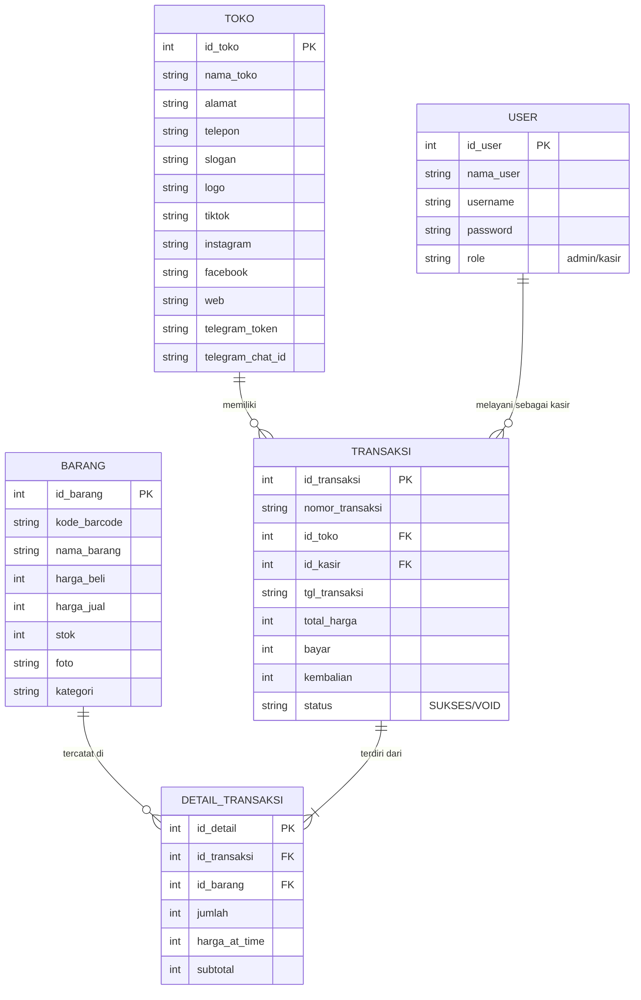

# Struktur Database POS (Point of Sale) - Referensi AI Agent

Dokumen ini berisi struktur database relasional yang dirancang khusus untuk membangun aplikasi Kasir/POS. Struktur ini dapat digunakan sebagai instruksi (prompt) bagi AI Agent untuk menggenerasi model, database helper, maupun logic bisnis aplikasi.

## 📊 Gambaran ERD (Entity Relationship Diagram)



---

## 🛠 Detail Tabel & Kolom

### 1. Tabel: `TOKO`
Menyimpan profil identitas toko yang akan muncul di struk belanja.
| Kolom | Tipe | Keterangan |
| :--- | :--- | :--- |
| `id_toko` | INTEGER (PK) | Auto-increment |
| `nama_toko` | TEXT | Nama bisnis/toko |
| `alamat` | TEXT | Alamat lengkap |
| `telepon` | TEXT | Nomor WhatsApp/Telepon |
| `logo` | TEXT | Path/URL gambar logo |
| `sosial_media` | TEXT | (TikTok, IG, FB, Web) untuk branding |

### 2. Tabel: `USER`
Manajemen akses aplikasi.
| Kolom | Tipe | Keterangan |
| :--- | :--- | :--- |
| `id_user` | INTEGER (PK) | Auto-increment |
| `nama_user` | TEXT | Nama lengkap pegawai |
| `username` | TEXT (Unique) | Digunakan untuk login |
| `role` | TEXT | Hak akses (e.g., 'ADMIN' atau 'KASIR') |

### 3. Tabel: `BARANG`
Master data produk/inventori.
| Kolom | Tipe | Keterangan |
| :--- | :--- | :--- |
| `id_barang` | INTEGER (PK) | Auto-increment |
| `kode_barcode` | TEXT | Kode unik produk (EAN13/UPC) |
| `nama_barang` | TEXT | Nama produk |
| `harga_beli` | INTEGER | Harga modal |
| `harga_jual` | INTEGER | Harga jual ke konsumen |
| `stok` | INTEGER | Jumlah sisa barang |
| `kategori` | TEXT | Pengelompokan barang |

### 4. Tabel: `TRANSAKSI`
Header atau ringkasan penjualan.
| Kolom | Tipe | Keterangan |
| :--- | :--- | :--- |
| `id_transaksi` | INTEGER (PK) | Auto-increment |
| `nomor_transaksi` | TEXT | Format unik (e.g., TRX-20240407-001) |
| `tgl_transaksi` | TEXT | Format ISO8601 (YYYY-MM-DD HH:mm:ss) |
| `total_harga` | INTEGER | Total belanja sebelum bayar |
| `bayar` | INTEGER | Uang yang diberikan pelanggan |
| `status` | TEXT | Default: 'SUKSES'. Bisa 'VOID' jika dibatalkan. |

### 5. Tabel: `DETAIL_TRANSAKSI`
Rincian item per transaksi.
| Kolom | Tipe | Keterangan |
| :--- | :--- | :--- |
| `id_transaksi` | INTEGER (FK) | Relasi ke tabel TRANSAKSI |
| `id_barang` | INTEGER (FK) | Relasi ke tabel BARANG |
| `jumlah` | INTEGER | Kuantitas yang dibeli |
| `harga_at_time` | INTEGER | Harga jual saat transaksi terjadi (Snapshot) |
| `subtotal` | INTEGER | `jumlah * harga_at_time` |

---

## 💡 SQL Schema (Dapat di-copy ke AI Agent)

```sql
-- Tabel Profil Toko
CREATE TABLE TOKO (
    id_toko INTEGER PRIMARY KEY AUTOINCREMENT,
    nama_toko TEXT,
    alamat TEXT,
    telepon TEXT,
    slogan TEXT,
    logo TEXT,
    tiktok TEXT,
    instagram TEXT,
    facebook TEXT,
    web TEXT,
    telegram_token TEXT,
    telegram_chat_id TEXT
);

-- Tabel Pengguna
CREATE TABLE USER (
    id_user PRIMARY KEY AUTOINCREMENT,
    nama_user TEXT,
    username TEXT UNIQUE,
    password TEXT,
    role TEXT
);

-- Tabel Master Barang
CREATE TABLE BARANG (
    id_barang INTEGER PRIMARY KEY AUTOINCREMENT,
    kode_barcode TEXT,
    nama_barang TEXT,
    harga_beli INTEGER,
    harga_jual INTEGER,
    stok INTEGER,
    foto TEXT,
    kategori TEXT
);

-- Tabel Header Transaksi
CREATE TABLE TRANSAKSI (
    id_transaksi INTEGER PRIMARY KEY AUTOINCREMENT,
    nomor_transaksi TEXT,
    id_toko INTEGER,
    id_kasir INTEGER,
    tgl_transaksi TEXT,
    total_harga INTEGER,
    bayar INTEGER,
    kembalian INTEGER,
    status TEXT DEFAULT 'SUKSES',
    FOREIGN KEY (id_toko) REFERENCES TOKO (id_toko),
    FOREIGN KEY (id_kasir) REFERENCES USER (id_user)
);

-- Tabel Detail Item Transaksi
CREATE TABLE DETAIL_TRANSAKSI (
    id_detail INTEGER PRIMARY KEY AUTOINCREMENT,
    id_transaksi INTEGER,
    id_barang INTEGER,
    jumlah INTEGER,
    harga_at_time INTEGER,
    subtotal INTEGER,
    FOREIGN KEY (id_transaksi) REFERENCES TRANSAKSI (id_transaksi),
    FOREIGN KEY (id_barang) REFERENCES BARANG (id_barang)
);
```

---

## 🚀 Tips untuk Siswa (Instruksi AI Agent)
Siswa dapat memberikan prompt seperti ini kepada AI Agent:
> *"Berdasarkan struktur database di atas, tolong buatkan class Model di Flutter menggunakan Dart, lengkap dengan method `toMap()` dan `fromMap()`, serta buatkan `DatabaseHelper` menggunakan package `sqflite`."*
